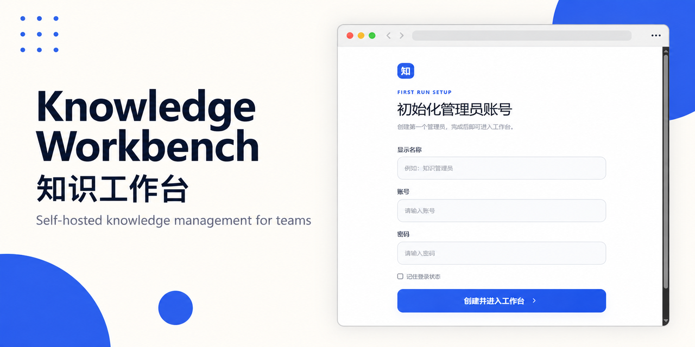

# Knowledge Workbench（知识工作台）

[中文](README.md) | [English](README.en.md)

[](https://github.com/HyperionCHI/Knowledge_Benchmark/actions/workflows/ci.yml)
[](LICENSE)



一个面向团队的自托管知识库，集资料与制度、品牌/产品 SOP、项目链接、附件、术语、模板、个人待办和组织待办于同一界面。

**Self-hosted knowledge management for teams.** Built with React, TypeScript, SQLite, Markdown, Mermaid and Better Auth.

此目录是经过数据清理的发布副本：不包含原项目的数据库、账号、会话、知识正文、品牌目录、业务链接、附件、审计记录、行业术语或业务模板。首次启动会创建新的本地数据库，并引导创建首位管理员。

## 主要能力

- Markdown 知识文档，支持 Mermaid、表格、公式、图片和附件
- 品牌/产品目录与分层 SOP
- 文档分类、排序、状态、回收站和版本记录
- 附件版本、引用检查、下载与清理
- 术语库与模板库
- 个人周期待办与管理员下发的组织待办
- 管理员、编辑人员、普通用户三级权限
- SQLite 本地数据与本地附件存储
- 在线一致性备份和停服恢复

## 环境要求

- Node.js 22.14 或更高版本（推荐 Node.js 22.23.2）
- pnpm（推荐使用与 `pnpm-lock.yaml` 匹配的版本）
- Windows、macOS 或 Linux

## 快速开始

```bash
git clone https://github.com/HyperionCHI/Knowledge_Benchmark.git
cd Knowledge_Benchmark
cp .env.example .env
pnpm install --frozen-lockfile
pnpm dev
```

Windows PowerShell：

```powershell
git clone https://github.com/HyperionCHI/Knowledge_Benchmark.git
Set-Location Knowledge_Benchmark
Copy-Item .env.example .env
pnpm install --frozen-lockfile
pnpm dev
```

默认访问 `http://localhost:3001`。首次打开时创建管理员账号；初始化完成后，自助注册会自动关闭。

Windows 用户也可以双击 `启动工作台.cmd`。该脚本会检查依赖和生产构建，并在服务就绪后打开浏览器。它固定使用本机 `3001` 端口，适合本地快速体验。

## 生产运行

```bash
pnpm install --frozen-lockfile
pnpm build
pnpm start
```

构建后也可以直接运行独立产物：

```bash
node dist/standalone/server.js
```

独立产物根目录同时包含本项目许可证、第三方组件清单、完整第三方许可证文本和 MPL 对应源码获取说明。部署或转交 standalone 目录时，不要删除这些文件。

生产环境必须设置新的 `BETTER_AUTH_SECRET`，并让 `BETTER_AUTH_URL` 与实际访问地址完全一致。局域网或反向代理部署还应通过 `BETTER_AUTH_TRUSTED_ORIGINS` 列出允许发起认证请求的完整来源。完整说明见 [部署指南](docs/DEPLOYMENT.md)。

## 配置

| 变量 | 必需 | 默认值 | 说明 |
| --- | --- | --- | --- |
| `BETTER_AUTH_SECRET` | 生产必需 | 示例占位值 | 至少 32 字节的随机密钥，禁止提交真实值 |
| `BETTER_AUTH_URL` | 是 | `http://localhost:3001` | 用户实际访问的完整源地址 |
| `BETTER_AUTH_TRUSTED_ORIGINS` | 否 | localhost 与 127.0.0.1 | 允许发起认证请求的完整来源，多个来源用英文逗号分隔 |
| `WORKBENCH_DB_PATH` | 否 | `./data/workbench.sqlite` | SQLite 数据库路径 |
| `WORKBENCH_ATTACHMENT_DIR` | 否 | `./data/attachments` | 附件存储目录 |
| `PORT` | 否 | `3001` | HTTP 服务端口 |

从 `.env.example` 创建 `.env`，不要把 `.env`、数据库或附件提交到 Git。

## 数据与隐私

运行数据默认位于：

```text
data/
├── workbench.sqlite
└── attachments/
```

`data/`、`.env*`、备份目录、依赖和构建产物均已加入 `.gitignore`。发布前运行：

```bash
pnpm release:check
```

该检查会确认发布目录中没有数据库、附件、真实环境文件、原项目路径或已移除的数据种子，并校验项目许可证、第三方组件清单、MPL 源码说明和 standalone 许可证材料。更多说明见 [数据与安全](docs/DATA_SECURITY.md)。

## 备份与恢复

运行中备份：

```bash
pnpm backup -- /path/to/backups
```

停服后恢复：

```bash
pnpm restore -- /path/to/backups/knowledge-workbench-TIMESTAMP --confirm-stopped
```

恢复脚本会验证清单、SQLite 完整性和附件引用，并为当前数据保留可回滚副本。

## 文档

- [使用指南](docs/USER_GUIDE.md)
- [部署指南](docs/DEPLOYMENT.md)
- [数据与安全](docs/DATA_SECURITY.md)
- [GitHub 发布清单](docs/GITHUB_RELEASE_CHECKLIST.md)
- [贡献指南](CONTRIBUTING.md)
- [安全策略](SECURITY.md)

## 开发与验证

```bash
pnpm lint
pnpm test
pnpm license:check
pnpm release:check
```

`pnpm test` 包含生产构建以及账号、知识记录、待办、恢复流程和 Markdown 渲染测试。

## 技术栈

- React 19、TypeScript、Vinext/Vite
- Better Auth
- SQLite、better-sqlite3、Drizzle ORM
- Cherry Markdown、React Markdown、Mermaid

## 许可证

Knowledge Workbench 自身代码采用 [Apache License 2.0](LICENSE)，版权所有者为 Knowledge Workbench contributors。

第三方开源组件仍分别受其原始许可证约束：

- [第三方组件清单](THIRD_PARTY_NOTICES.md)
- [完整第三方许可证与 NOTICE](THIRD_PARTY_LICENSES.txt)
- [MPL-2.0 对应源码获取说明](MPL_SOURCE_OFFER.md)

每次生产构建前会自动重新生成第三方清单，并将上述材料复制到 `dist/standalone`。托管后的 `/third-party-notices.txt` 和 `/third-party-licenses.txt` 也提供对应内容。
